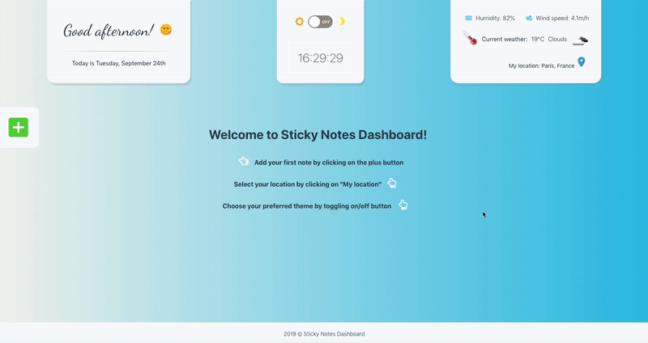

# Sticky Notes Dashboard

Sticky Notes Dashboard is an app for writing digital sticky notes. 

* Notes Dashboard includes a mini weather app. London, UK is set as default, however users can change it to a different location to see the current weather forecast. 
* App offers two themes based on a personal preference: Light Blue or Midnight Purple. 
* Location, preffered theme and notes are saved to local storage. 

This app was built with React Hooks. Although designed for desktop use, it is mobile friendly. Styled with CSS Grid Layout and Flexbox. Weather information comes from OpenWeatherMap API. 

The deployed version can be seen here:

https://kate-gill.github.io/sticky-notes-dashboard/

Mini demo gif is shown below:

